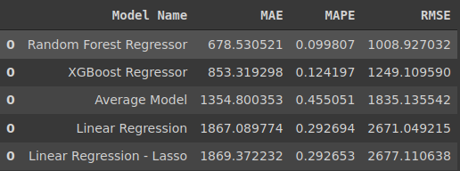
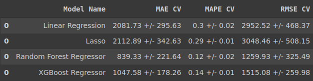
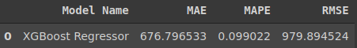
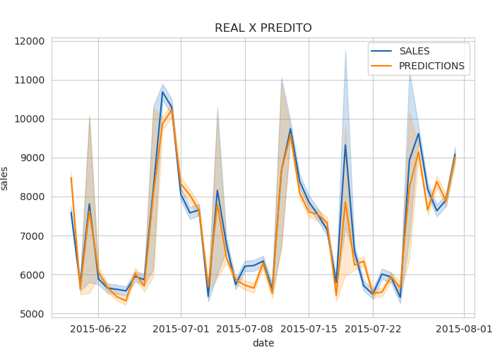
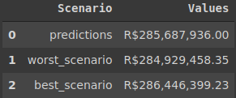

# Previsão de vendas das farmácias Rossmann

## 1.Sobre o Projeto

Este projeto é fictício usando dados disponíveis no Kaggle para desenvolver os estudos sobre Machine Learning, 
mais espcificamente um modelo para a previsão das vendas em 6 semanas. Utilizaremos o método CRISP-DS, seguindo os 
11 passos descritos na seção 6(planejamento da solução).

## 2.Tecnologias Utilizadas

**Python, Pandas, NumPy, Heroku, XGBoost, Seaborn, Boruta, Matplotlib, Telegram, Scikit-Learn, Jupyter Notebook**

## 3.Contato

  
silveira.a.n@gmail.com

  
https://www.linkedin.com/in/alexsandronsilveira/

    
## 4.Atributos
    
| Atributos                        | Descrição                                                    |
| -------------------------------- | ------------------------------------------------------------ |
| Id                               | Um Id que representa uma dupla (Store, Date) dentro do conjunto de teste |
| Store                            | Um id único para cada loja                                   |
| Sales                            | O volume de vendas para qualquer dia                         |
| Customers                        | O número de clientes em um determinado dia                       |
| Open                             | Um indicador para saber se a loja estava aberta: 0 = fechada, 1 = aberta |
| StateHoliday                     | Indica um feriado estadual. Normalmente todas as lojas, com poucas exceções, fecham nos feriados estaduais. Observe que todas as escolas fecham nos feriados e finais de semana. a = feriado, b = feriado da Páscoa, c = Natal, 0 = Nenhum |
| SchoolHoliday                    | Indica se (Loja, Data) foi afetado pelo fechamento de escolas públicas |
| StoreType                        | Diferencia entre 4 modelos de loja diferentes: a, b, c, d  |
| Assortment                       | Descreve um nível de estoque: a = básico, b = extra, c = estendido |
| CompetitionDistance              | Distancia em metros do competidor mais proximo           |
| CompetitionOpenSince[Month/Year] | Dá o ano e mês aproximados em que o concorrente mais próximo foi aberto |
| Promo                            | Indica se uma loja está fazendo uma promoção naquele dia         |
| Promo2                           | Promo2 é uma promoção contínua e consecutiva para algumas lojas: 0 = a loja não está participando, 1 = a loja está participando |
| Promo2Since[Year/Week]           | Descreve o ano e a semana em que a loja começou a participar da Promo2 |
| PromoInterval                    | Descreve os intervalos consecutivos de início da promoção 2, nomeando os meses em que a promoção é iniciada novamente. Por exemplo. "Fev, maio, agosto, novembro" significa que cada rodada começa em fevereiro, maio, agosto, novembro de qualquer ano para aquela loja |
    
## 5.Problema de Negócio

Pensando em um investimento nas lojas da Rossmann o CFO pediu uma previsão das vendas dessas lojas para empreender 
    parte do lucro nessas reformas.

## 6. Planejamento da Solução

O projeto foi desenvolvido através do método CRISP-DM, ou seja, é feita um primeiro estudo dos dados e desenvolve-se 
o modelo de Machine Learning e julgmaos a eficiência do modelo desnvolvido e então é decidido se refazemos mais 
um ciclo ou encerramos o projeto. Aplicamos os seguintes passos:

**Passo 01 - Descrição dos Dados:** Na primeira etapa realizamos um reconhecimentos dos dados e desenvolvendo 
    um melhor entendimento de como esses dados descrevem os comportamento s de interesse para o desenvolvimento 
    do modelo.
    
**Passo 02 - Feature Engineering:** Nesta etapa são criados novos atributos que melhor descrevem os fenômeno a ser 
    modelado.
    
**Passo 03 - Filtragem de Variáveis:** Aqui é realizada a avaliação de quais as variáveis não são relevantes para 
    o modelo.
    
**Passo 04 - Análise Exploratória de Dados:** O objetivo aqui é encontrar alguns insights e entender a relevância 
    das variáveis para o modelo de Machine Learning.
    
**Passo 05 - Preparação dos Dados:** Nesse passo começamos a preparar os dados para o terinamento do modelo.
    
**Passo 06 - Seleção de Variáveis:** Usando o algoritmo Boruta selecionamos os melhores atributos a serem inseridos 
    no treinamento do modelo de Machine Learning.
    
**Passo 07 - Machine Learning Modeling:** Nesta etapa usamos alguns modelos de Machine Learning para avaliar qual 
    é mais eficiente para o nosso propósito, para ter uma melhor definição da eficiência dos medlos usamos a técnica 
    Cross Validation.
    
**Passo 08 - Hyperparameter Fine Tunning:** Na etapa anterior foi escolhido o algoritmo XGBoost, usando o método 
    Random Search foi decidido qual os melhores parametros para terinar o modelo.
    
**Passo 09 - Tradução e Interpretação do Erro:** O objetivo desse passo éapresentar o resultado do modelo, 
    apontando qual o impacto financeiro pode ser esperado baseado no modelo desenvolvido.
    
**Passo 10 - Deploy do Modelo em Produção:** O modelo foi hospedado online para que outras pessoas possam ter acesso 
    aos resultados obtidos.
    
## 7. Performance do Modelo
    
A performance é medida por MAE, MAPE e RMSE

**MAE:** Calcula o "erro absoluto médio" dos erros entre valores observados e predições.

**MAPE:** Calcula o "erro absoluto médio percentual" dos erros entre valores observados e predições.
    
**RMSE:** É a medida que calcula "a raiz quadrática média" dos erros entre valores observados (reais) e predições (hipóteses).
    
### 7.1 Performance dos modelos
    

    
### 7.2 Performance dos modelos - Cross Validation
    

    
### 7.3 Performance final - XGBoost
    

    
#### 7.3.1 Performance final - Precisão do modelo
    

    
 ### 7.4 Performance financeira do modelo

    
## 8. Deploy do Modelo
    
O modelo foi colocado em produção hospedado online e foi desenvolvido uma aplicação para que as predições do modelo 
    sejam acessadas pelo Telegram
    
 

## 9. Conclusão
    
O erro médio do modelo ficou em torno de 10%, é um erro razoável para colocar o modelo em produção. 
Essa é a principal vantagem do método CRISP-DS, pois realizamos uma etapa rápida e avaliamos o resultado, 
se for aceitável colocamos em produção, caso o erro tivesse ficado maior realizaríamos um novo ciclo, já sabendo da 
viabilidade do projeto, melhorando os parametros necessários para diminuir o erro.

    
    
